# Codex CLI 架构与运行原理完全指南

> 本文档面向新手，详细阐述 Codex CLI 项目的完整架构、代码流程、模块职责与运行原理。
> 基于 OpenAI Codex CLI 开源仓库，结合企业内部部署修改版本。

---

## 目录

1. [项目概览](#1-项目概览)
2. [整体架构](#2-整体架构)
3. [核心概念与术语](#3-核心概念与术语)
4. [三大运行入口](#4-三大运行入口)
5. [代码组织与 Crate 地图](#5-代码组织与-crate-地图)
6. [核心引擎 (`codex-core`) 深度解析](#6-核心引擎-codex-core-深度解析)
7. [Session 会话与 Turn 执行流程](#7-session-会话与-turn-执行流程)
8. [App-Server 架构](#8-app-server-架构)
9. [TUI 终端界面架构](#9-tui-终端界面架构)
10. [工具系统 (Tools)](#10-工具系统-tools)
11. [MCP 集成架构](#11-mcp-集成架构)
12. [Sandbox 沙箱系统](#12-sandbox-沙箱系统)
13. [Plugin 与 Skills 系统](#13-plugin-与-skills-系统)
14. [模型提供商系统](#14-模型提供商系统)
15. [数据流转全景图](#15-数据流转全景图)
16. [构建系统](#16-构建系统)
17. [配置文件系统](#17-配置文件系统)
18. [附录：关键文件索引](#18-附录关键文件索引)

---

## 1. 项目概览

Codex CLI 是 OpenAI 开源的终端 AI 编程助手。它是一个用 Rust 编写的命令行工具，可调用大语言模型（LLM）在本地执行代码、操作文件、管理 Git 仓库等。

**本仓库的特殊之处**：基于官方仓库修改，专为企业内部部署设计：
- 所有外部数据上报（Sentry, 遥测, 更新检查等）已禁用
- 认证端点已清空，支持本地模型（Ollama, LM Studio）
- User-Agent 已伪装为 `RooCode/3.51.1`
- 可通过 `base_url` 指向企业内部 LLM 服务

**核心能力**：
- 交互式对话式编程（TUI 模式）
- 非交互式单次执行（Exec 模式）
- MCP 服务器模式
- 沙箱化命令执行
- 多 Agent 协作
- 插件与 Skills 扩展

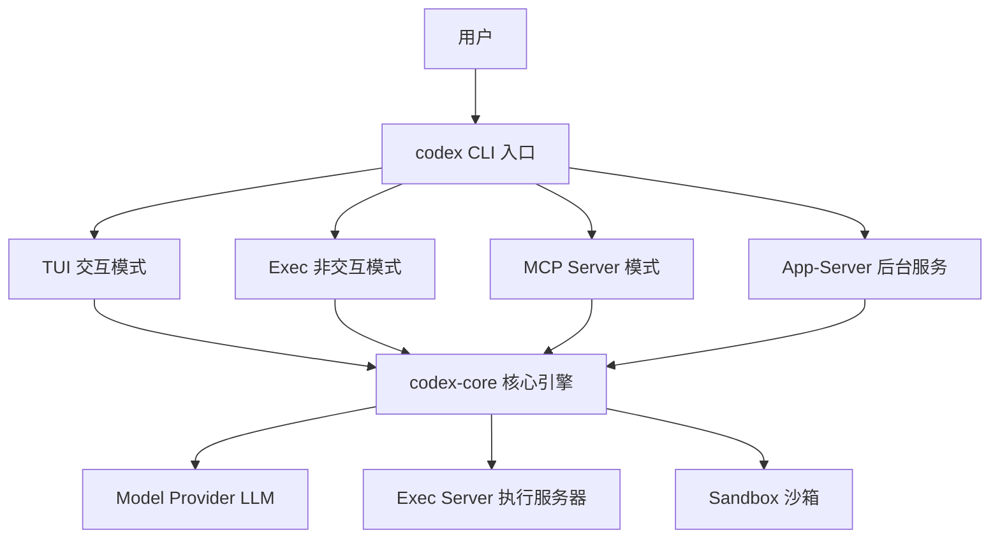
```mermaid
graph TD
    A["用户"] --> B["codex CLI 入口"]
    B --> C["TUI 交互模式"]
    B --> D["Exec 非交互模式"]
    B --> E["MCP Server 模式"]
    B --> F["App-Server 后台服务"]
    C --> G["codex-core 核心引擎"]
    D --> G
    E --> G
    F --> G
    G --> H["Model Provider LLM"]
    G --> I["Exec Server 执行服务器"]
    G --> J["Sandbox 沙箱"]
```

---

## 2. 整体架构

Codex CLI 采用**多层架构**，从底到顶分为：

```
┌─────────────────────────────────────────────────────────────┐
│                    用户界面层 (UI Layer)                      │
│  ┌──────────────┐  ┌──────────────┐  ┌───────────────────┐  │
│  │  codex-tui   │  │  codex-exec  │  │ codex-mcp-server  │  │
│  │  (终端交互)   │  │  (非交互执行)  │  │   (MCP 协议服务)   │  │
│  └──────┬───────┘  └──────┬───────┘  └────────┬──────────┘  │
├─────────┼─────────────────┼───────────────────┼─────────────┤
│         │        通信层 (Transport Layer)       │             │
│  ┌──────┴──────────────────┴───────────────────┴──────────┐ │
│  │              codex-app-server-client                   │ │
│  │   (stdio / Unix Socket / WebSocket / In-Process)       │ │
│  └──────────────────────┬─────────────────────────────────┘ │
├─────────────────────────┼───────────────────────────────────┤
│         │        服务层 (Service Layer)       │               │
│  ┌──────┴────────────────────────────────────┴──────────┐   │
│  │                  codex-app-server                    │   │
│  │   (线程管理 / 配置管理 / MCP管理 / Plugin管理)         │   │
│  └──────────────────────┬───────────────────────────────┘   │
├─────────────────────────┼───────────────────────────────────┤
│         │        核心引擎层 (Core Engine Layer)    │          │
│  ┌──────┴────────────────────────────────────────┴──────┐   │
│  │                    codex-core                         │   │
│  │   Session → Turn → Model Client → Tool Execution      │   │
│  │   状态管理 / 上下文组装 / Hook 系统 / Guardian         │   │
│  └──────────────────────┬───────────────────────────────┘   │
├─────────────────────────┼───────────────────────────────────┤
│         │        基础服务层 (Infrastructure Layer) │          │
│  ┌──────┴────────────────────────────────────────┴──────┐   │
│  │  exec-server │ sandbox │ plugin │ skills │ model-    │   │
│  │  (进程管理)   │ (沙箱)   │ (插件)  │ (技能)  │ provider  │   │
│  └──────────────────────────────────────────────────────┘   │
└─────────────────────────────────────────────────────────────┘
```

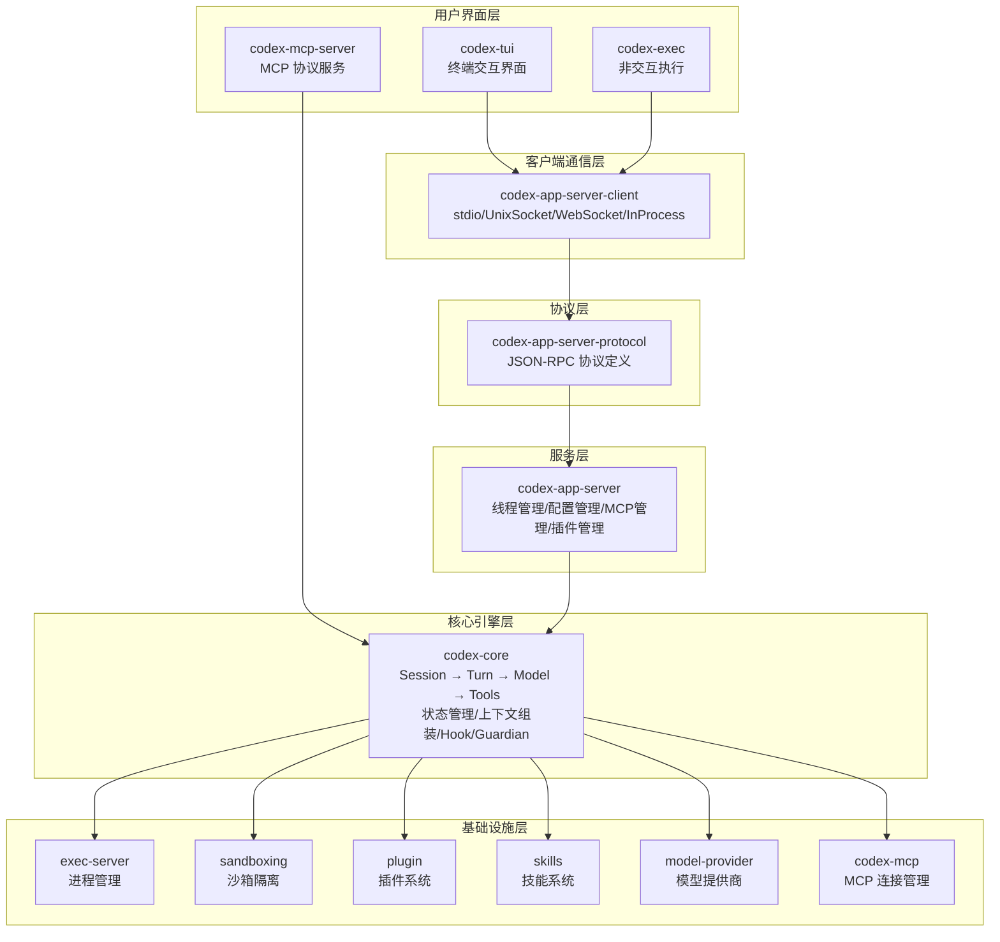
```mermaid
flowchart TB
    subgraph UI["用户界面层"]
        TUI["codex-tui<br/>终端交互界面"]
        EXEC["codex-exec<br/>非交互执行"]
        MCP_SRV["codex-mcp-server<br/>MCP 协议服务"]
    end

    subgraph CLIENT["客户端通信层"]
        ASC["codex-app-server-client<br/>stdio/UnixSocket/WebSocket/InProcess"]
    end

    subgraph PROTO["协议层"]
        ASP["codex-app-server-protocol<br/>JSON-RPC 协议定义"]
    end

    subgraph SERVER["服务层"]
        AS["codex-app-server<br/>线程管理/配置管理/MCP管理/插件管理"]
    end

    subgraph CORE["核心引擎层"]
        CO["codex-core<br/>Session → Turn → Model → Tools<br/>状态管理/上下文组装/Hook/Guardian"]
    end

    subgraph INFRA["基础设施层"]
        ES["exec-server<br/>进程管理"]
        SB["sandboxing<br/>沙箱隔离"]
        PL["plugin<br/>插件系统"]
        SK["skills<br/>技能系统"]
        MP["model-provider<br/>模型提供商"]
        MC["codex-mcp<br/>MCP 连接管理"]
    end

    TUI --> ASC
    EXEC --> ASC
    MCP_SRV --> CO
    ASC --> ASP
    ASP --> AS
    AS --> CO
    CO --> ES
    CO --> SB
    CO --> PL
    CO --> SK
    CO --> MP
    CO --> MC
```

---

## 3. 核心概念与术语

在深入代码之前，先理解这些关键概念：

| 术语 | 含义 | 对应代码 |
|------|------|---------|
| **Thread** | 一次完整的对话会话，包含多轮 Turn。每个 Thread 有唯一的 ThreadId (UUID) | `codex_thread.rs`, `ThreadId` |
| **Turn** | Thread 中的一轮交互：用户输入 → 模型推理 → 工具调用循环 → 返回结果 | `session/turn.rs`, `run_turn()` |
| **Session** | 运行时的状态容器，持有当前 Thread 的配置、模型客户端、工具路由等 | `session/session.rs`, `Session` |
| **Op** | 用户操作抽象（UserTurn / UserInput / Interrupt 等），是 Session 的事件输入 | `protocol.rs`, `Op` |
| **Event** | Session 内部状态变化的通知（错误、工具输出、Agent 状态等） | `protocol.rs`, `Event` |
| **Agent** | 一个执行单元，可以是主 Agent（Root）或子 Agent（SubAgent） | `agent/` |
| **Model Client** | 与 LLM 提供商通信的客户端抽象，支持 SSE 和 WebSocket 两种流式传输 | `client.rs`, `ModelClient` |
| **Tool** | Agent 可调用的工具（shell 命令、文件读写、MCP 工具等） | `tools/` |
| **Guardian** | 安全检查子系统，在执行命令前进行风险评估 | `guardian/` |
| **Compact** | 对话压缩机制，当上下文超长时自动摘要历史消息 | `compact.rs` |
| **Plugin** | 扩展系统，提供 App Connectors 和 Skills | `plugin/`, `plugins/` |
| **Skill** | 可被 Agent 动态加载的专业领域提示词 | `skills/` |
| **MCP** | Model Context Protocol，允许 Codex 调用外部 MCP 服务器的工具 | `codex-mcp/`, `mcp-server/` |
| **Sandbox** | 命令执行的隔离环境（Linux bwrap, macOS seatbelt, Windows Restricted Token） | `sandboxing/`, `exec/` |

---

## 4. 三大运行入口

Codex CLI 有三个主要的二进制入口，对应三种使用模式。

### 4.1 入口对比

| 入口 | 二进制 Crate | 使用场景 | 默认行为 |
|------|------------|---------|---------|
| **TUI 模式** | `codex-tui` | 交互式对话编程 | 打开终端交互界面 |
| **CLI 多合一模式** | `codex` (根 Crate) | 统一入口，支持所有子命令 | 转发到 TUI 或执行子命令 |
| **Exec 模式** | `codex-exec` | 非交互单次执行 | 静默执行后退出 |

### 4.2 CLI 多合一入口流程

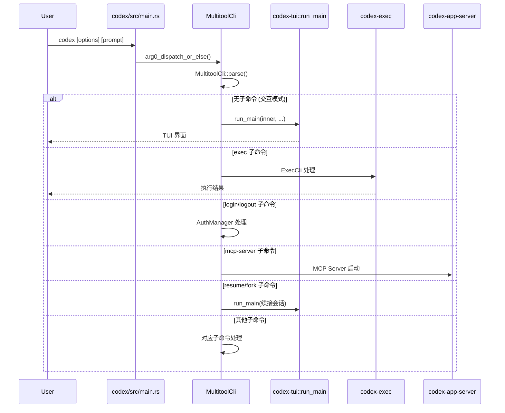
```mermaid
sequenceDiagram
    participant User
    participant main.rs as codex/src/main.rs
    participant CLI as MultitoolCli
    participant TUI as codex-tui::run_main
    participant EXEC as codex-exec
    participant AS as codex-app-server

    User->>main.rs: codex [options] [prompt]
    main.rs->>CLI: arg0_dispatch_or_else()
    CLI->>CLI: MultitoolCli::parse()
    
    alt 无子命令 (交互模式)
        CLI->>TUI: run_main(inner, ...)
        TUI-->>User: TUI 界面
    else exec 子命令
        CLI->>EXEC: ExecCli 处理
        EXEC-->>User: 执行结果
    else login/logout 子命令
        CLI->>CLI: AuthManager 处理
    else mcp-server 子命令
        CLI->>AS: MCP Server 启动
    else resume/fork 子命令
        CLI->>TUI: run_main(续接会话)
    else 其他子命令
        CLI->>CLI: 对应子命令处理
    end
```

CLI 多合一模式的子命令包括：

```
codex                        # TUI 交互模式（默认）
codex exec "prompt"          # 非交互执行
codex review                 # 代码审查
codex login                  # 登录管理
codex logout                 # 退出登录
codex mcp                    # MCP 服务器管理
codex plugin marketplace     # 插件市场管理
codex app-server             # 启动 App-Server
codex app                    # 启动桌面应用
codex sandbox [macos|linux|windows]  # 沙箱命令
codex resume [SESSION_ID]    # 续接历史会话
codex fork [SESSION_ID]      # 复制历史会话
codex debug models           # 调试：查看模型列表
codex features enable/disable  # 功能开关管理
```

### 4.3 TUI 入口流程

```mermaid
sequenceDiagram
    participant TUI as codex-tui::run_main
    participant APP as App (app.rs)
    participant ASC as AppServerClient
    participant LOOP as Event Loop

    TUI->>TUI: 加载 Config (load_config_as_toml_with_cli_overrides)
    TUI->>TUI: 检查 ExecPolicy (check_execpolicy_for_warnings)
    
    alt 连接远程 App-Server
        TUI->>ASC: RemoteAppServerClient::connect(ws_url)
    else 本地进程内
        TUI->>ASC: InProcessAppServerClient::start()
        ASC->>ASC: 启动 codex-app-server 线程
    end
    
    TUI->>APP: App::new(config, client, ...)
    TUI->>LOOP: app.run().await
    LOOP-->>User: 处理键盘事件、渲染 UI、与 Server 通信
```

---

## 5. 代码组织与 Crate 地图

项目采用 Rust Workspace 管理，核心代码位于 `codex-rs/` 目录，包含约 **90+ 个 Crate**。

### 5.1 目录结构总览

```
codex/                           # 项目根
├── codex-rs/                    # Rust workspace（核心代码）
│   ├── Cargo.toml               # Workspace 定义
│   ├── tui/                     # TUI 终端界面
│   ├── core/                    # 核心引擎
│   ├── app-server/              # App-Server 服务
│   ├── app-server-protocol/     # JSON-RPC 协议定义
│   ├── app-server-client/       # App-Server 客户端
│   ├── cli/                     # CLI 工具
│   ├── exec/                    # 非交互执行
│   ├── exec-server/             # 执行服务器（进程管理）
│   ├── protocol/                # 内部协议类型
│   ├── model-provider/          # 模型提供商适配
│   ├── plugin/                  # 插件系统
│   ├── skills/                  # 技能系统
│   ├── codex-mcp/               # MCP 连接管理
│   ├── mcp-server/              # MCP 服务器实现
│   ├── sandboxing/              # 沙箱系统
│   ├── login/                   # 认证系统
│   ├── codex-client/            # HTTP 客户端基础设施
│   ├── codex-api/               # OpenAI API 封装
│   ├── hooks/                   # Hook 系统
│   ├── config/                  # 配置加载
│   ├── state/                   # 状态持久化
│   ├── thread-store/            # Thread 存储
│   ├── tools/                   # 工具注册与定义
│   ├── rollout/                 # Rollout 追踪
│   ├── rollout-trace/           # Rollout 追踪数据格式
│   ├── features/                # 功能标志管理
│   ├── guardian/ → core/guardian  # 安全检查
│   ├── compact/ → core/compact    # 对话压缩
│   ├── connectors/              # App Connectors 集成
│   ├── git-utils/               # Git 工具
│   ├── file-system/             # 文件系统抽象
│   ├── file-search/             # 文件搜索
│   ├── feedback/                # 用户反馈
│   ├── analytics/               # 分析统计
│   ├── secrets/                 # 密钥管理
│   ├── shell-command/           # Shell 命令解析
│   ├── shell-escalation/        # Shell 权限提升
│   ├── linux-sandbox/           # Linux 沙箱 (bwrap)
│   ├── windows-sandbox-rs/      # Windows 沙箱
│   ├── realtime-webrtc/         # WebRTC 实时通信
│   ├── ollama/                  # Ollama 提供商
│   ├── lmstudio/                # LM Studio 提供商
│   └── utils/                   # 工具 Crate 集合
│       ├── absolute-path/       # 绝对路径类型
│       ├── cargo-bin/           # 二进制查找
│       ├── cache/               # 缓存
│       ├── pty/                 # PTY 终端
│       ├── stream-parser/       # 流式解析
│       └── ...
├── codex-cli/                   # Node.js 包装脚本
├── docs/                        # 文档
├── scripts/                     # 构建/测试脚本
└── sdk/                         # TypeScript SDK
```

### 5.2 关键 Crate 职责速查

以下按层次列出最重要的 Crate 及其核心文件：

#### 核心引擎层

| Crate | 职责 | 核心文件 |
|-------|------|---------|
| `codex-core` | 核心引擎：Session、Turn、Agent、Client、Tool、Guardian、Compact | `session.rs` (1000行), `turn.rs` (2200行), `client.rs` (2400行), `handlers.rs` (1200行) |
| `codex-protocol` | 内部类型定义：Event, Op, ThreadId, 配置类型 | `lib.rs`, `protocol.rs` |

#### 服务层

| Crate | 职责 | 核心文件 |
|-------|------|---------|
| `codex-app-server` | App-Server 主程序 | `lib.rs`, `message_processor.rs`, `thread_state.rs`, `transport/mod.rs` |
| `codex-app-server-protocol` | JSON-RPC 协议定义 | `common.rs` (宏定义), `v2.rs` (API 定义) |
| `codex-app-server-client` | App-Server 客户端 | InProcess/Remote 客户端实现 |

#### 用户界面层

| Crate | 职责 | 核心文件 |
|-------|------|---------|
| `codex-tui` | TUI 应用 | `app.rs`, `chatwidget.rs`, `markdown_render.rs` |
| `codex-exec` | 非交互执行 | `event_processor.rs` |
| `codex-mcp-server` | MCP 服务器 | `message_processor.rs` |

#### 基础设施层

| Crate | 职责 |
|-------|------|
| `codex-exec-server` | 进程执行管理，文件系统操作 |
| `codex-model-provider` | 模型提供商适配（Bearer Token 认证） |
| `codex-mcp` | MCP 客户端连接管理 |
| `codex-plugin` | 插件标识与元数据 |
| `codex-skills` | Skills 加载与管理 |
| `codex-sandboxing` | 沙箱策略与类型定义 |
| `codex-linux-sandbox` | Linux 沙箱实现（bubblewrap） |
| `codex-login` | 认证管理器 |
| `codex-config` | 配置加载堆栈 |
| `codex-state` | 状态持久化（log_db） |
| `codex-thread-store` | Thread 数据存储 |
| `codex-hooks` | Hook 系统 |
| `codex-features` | Feature Flag 管理 |

---

## 6. 核心引擎 (`codex-core`) 深度解析

`codex-core` 是整个项目的核心，拥有约 **7.4 万行** Rust 代码（按核心文件计算），是最复杂也是最重要的模块。

### 6.1 codex-core 内部模块地图

```
codex-rs/core/src/
├── lib.rs                     # Crate 根，公开 API 导出
├── codex_thread.rs            # Thread 抽象：CodexThread（对外 API）
├── session/                   # ⭐ Session 核心逻辑
│   ├── mod.rs                 # Session 模块入口
│   ├── session.rs             # Session / SessionConfiguration 定义
│   ├── turn.rs                # ⭐ Turn 执行核心（run_turn）
│   ├── handlers.rs            # ⭐ 事件处理器（interrupt, user_input_or_turn 等）
│   ├── turn_context.rs        # Turn 上下文（配置、技能、插件状态快照）
│   ├── mcp.rs                 # Session 级 MCP 操作
│   ├── multi_agents.rs        # 多 Agent 协调
│   ├── review.rs              # Code Review 逻辑
│   ├── rollout_reconstruction.rs # 从 Rollout 重建状态
│   └── tests.rs               # Session 集成测试
├── client.rs                  # ⭐ ModelClient（与 LLM 通信的核心）
├── client_common.rs           # 客户端通用工具（Prompt 构建）
├── agent/                     # Agent 管理
│   ├── mod.rs
│   ├── control.rs             # AgentControl（生命周期管理）
│   ├── mailbox.rs             # Mailbox（Agent 间消息队列）
│   ├── role.rs                # Agent 角色定义
│   ├── status.rs              # Agent 状态
│   └── agent_resolver.rs      # Agent 解析
├── guardian/                  # ⭐ Guardian 安全检查
│   ├── mod.rs                 # Guardian 主逻辑
│   ├── approval_request.rs    # 审批请求
│   ├── prompt.rs              # Guardian 提示词
│   ├── review.rs              # Guardian Review
│   └── review_session.rs      # Guardian Review Session
├── exec.rs                    # ⭐ 命令执行（交互命令）
├── exec_env.rs                # 执行环境管理
├── exec_policy.rs             # 执行策略
├── tools/                     # 工具注册与路由
├── compact.rs                 # 对话压缩
├── compact_remote.rs          # 远程对话压缩
├── config/                    # 配置系统
│   ├── mod.rs
│   ├── edit.rs                # 配置编辑
│   ├── permissions.rs         # 权限配置
│   └── schema.rs              # 配置 JSON Schema
├── skills.rs / skills_watcher.rs  # Skills 管理
├── plugins.rs                 # Plugin 管理
├── connectors.rs              # App Connector 管理
├── context/                   # 上下文组装
├── context_manager.rs         # 上下文管理器
├── hook_runtime.rs            # Hook 运行时
├── goals.rs                   # Goal 追踪
├── commit_attribution.rs      # 提交归属
├── mention_syntax.rs          # @mention 语法解析
├── message_history.rs         # 消息历史
├── prompt_debug.rs            # Prompt 调试
├── memory_trace.rs            # 记忆追踪
├── memory_usage.rs            # 记忆用量
├── network_policy_decision.rs # 网络策略
├── network_proxy_loader.rs    # 网络代理加载
└── file_watcher.rs            # 文件监控
```

### 6.2 CodexThread — 外部 API 入口

`CodexThread` 是 `codex-core` 对外暴露的主要 API：

```rust
// codex-rs/core/src/codex_thread.rs
pub struct CodexThread {
    pub(crate) codex: Codex,           // Session 包装器
    pub(crate) session_source: SessionSource,
    rollout_path: Option<PathBuf>,
    out_of_band_elicitation_count: Mutex<u64>,
    _watch_registration: WatchRegistration,
}

impl CodexThread {
    pub async fn submit(&self, op: Op) -> CodexResult<String> { ... }
    pub async fn shutdown_and_wait(&self) -> CodexResult<()> { ... }
    pub async fn wait_until_terminated(&self) { ... }
}
```

**对外 API 调用链**：

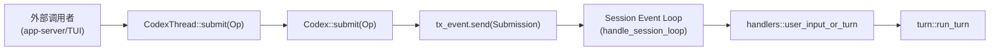
```mermaid
graph LR
    A["外部调用者<br/>(app-server/TUI)"] --> B["CodexThread::submit(Op)"]
    B --> C["Codex::submit(Op)"]
    C --> D["tx_event.send(Submission)"]
    D --> E["Session Event Loop<br/>(handle_session_loop)"]
    E --> F["handlers::user_input_or_turn"]
    F --> G["turn::run_turn"]
```

---

## 7. Session 会话与 Turn 执行流程

这是整个项目最核心的执行流程，涉及约 **5000+ 行** Rust 代码。

### 7.1 Session 初始化流程

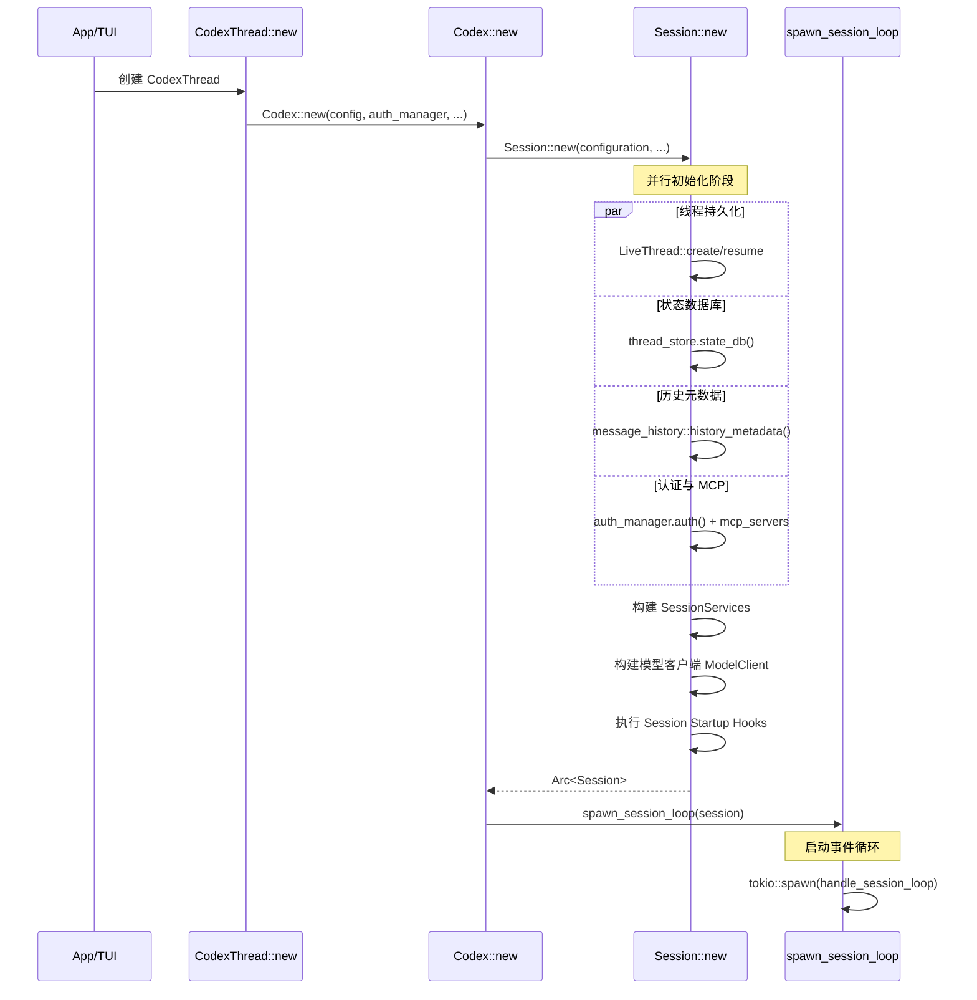
```mermaid
sequenceDiagram
    participant App as App/TUI
    participant CT as CodexThread::new
    participant C as Codex::new
    participant S as Session::new
    participant SP as spawn_session_loop

    App->>CT: 创建 CodexThread
    CT->>C: Codex::new(config, auth_manager, ...)
    C->>S: Session::new(configuration, ...)
    
    Note over S: 并行初始化阶段
    par 线程持久化
        S->>S: LiveThread::create/resume
    and 状态数据库
        S->>S: thread_store.state_db()
    and 历史元数据
        S->>S: message_history::history_metadata()
    and 认证与 MCP
        S->>S: auth_manager.auth() + mcp_servers
    end
    
    S->>S: 构建 SessionServices
    S->>S: 构建模型客户端 ModelClient
    S->>S: 执行 Session Startup Hooks
    S-->>C: Arc<Session>
    C->>SP: spawn_session_loop(session)
    
    Note over SP: 启动事件循环
    SP->>SP: tokio::spawn(handle_session_loop)
```

**Session 结构体**包含以下关键字段：

```rust
// codex-rs/core/src/session/session.rs
pub(crate) struct Session {
    pub(crate) conversation_id: ThreadId,      // 会话 ID
    pub(super) tx_event: Sender<Event>,         // 事件发送通道
    pub(super) agent_status: watch::Sender<AgentStatus>,  // Agent 状态广播
    pub(super) state: Mutex<SessionState>,       // 可变状态（当前 Turn 等）
    pub(super) features: ManagedFeatures,        // 启用的功能标志
    pub(crate) conversation: Arc<RealtimeConversationManager>,  // 实时对话
    pub(crate) active_turn: Mutex<Option<ActiveTurn>>,  // 当前活跃 Turn
    pub(super) mailbox: Mailbox,                 // Agent 间消息信箱
    pub(crate) goal_runtime: GoalRuntimeState,   // Goal 运行时状态
    pub(crate) guardian_review_session: GuardianReviewSessionManager,
    pub(crate) services: SessionServices,        // 共享服务集合
}

#[derive(Clone)]
pub(crate) struct SessionConfiguration {
    pub(super) provider: ModelProviderInfo,      // 模型提供商信息
    pub(super) collaboration_mode: CollaborationMode,  // 协作模式
    pub(super) approval_policy: Constrained<AskForApproval>,  // 审批策略
    pub(super) permission_profile: Constrained<PermissionProfile>,  // 权限配置
    pub(super) cwd: AbsolutePathBuf,             // 工作目录
    pub(super) codex_home: AbsolutePathBuf,      // Codex 数据目录
    pub(super) session_source: SessionSource,    // 会话来源
    // ... 更多配置
}
```

### 7.2 Session Event Loop — 事件循环

Session 启动后会进入主事件循环 `handle_session_loop`：

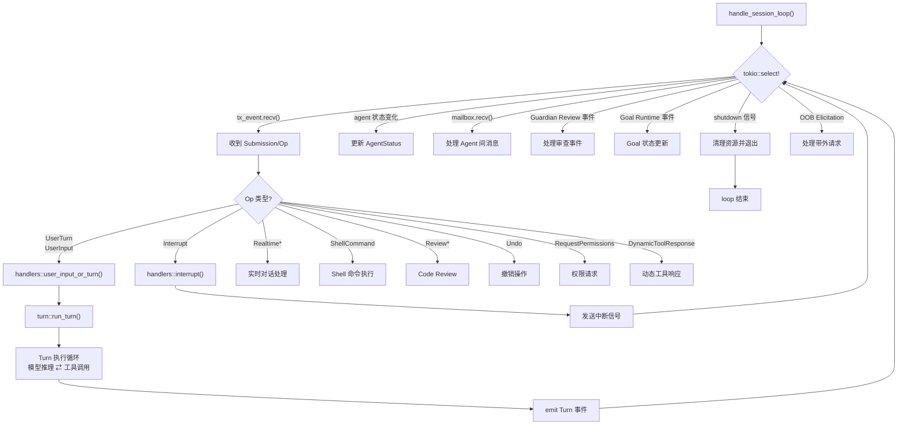
```mermaid
flowchart TD
    START["handle_session_loop()"] --> LOOP{"tokio::select!"}
    
    LOOP -->|"tx_event.recv()"| RECV_EVENT["收到 Submission/Op"]
    LOOP -->|"agent 状态变化"| AGENT_CHANGE["更新 AgentStatus"]
    LOOP -->|"mailbox.recv()"| MAILBOX["处理 Agent 间消息"]
    LOOP -->|"Guardian Review 事件"| REVIEW["处理审查事件"]
    LOOP -->|"Goal Runtime 事件"| GOAL["Goal 状态更新"]
    LOOP -->|"shutdown 信号"| SHUTDOWN["清理资源并退出"]
    LOOP -->|"OOB Elicitation"| OOB["处理带外请求"]
    
    RECV_EVENT --> DISPATCH{"Op 类型?"}
    DISPATCH -->|"UserTurn<br/>UserInput"| HANDLE_USER["handlers::user_input_or_turn()"]
    DISPATCH -->|"Interrupt"| HANDLE_INT["handlers::interrupt()"]
    DISPATCH -->|"Realtime*"| HANDLE_RT["实时对话处理"]
    DISPATCH -->|"ShellCommand"| HANDLE_SH["Shell 命令执行"]
    DISPATCH -->|"Review*"| HANDLE_RV["Code Review"]
    DISPATCH -->|"Undo"| HANDLE_UNDO["撤销操作"]
    DISPATCH -->|"RequestPermissions"| HANDLE_PERM["权限请求"]
    DISPATCH -->|"DynamicToolResponse"| HANDLE_DT["动态工具响应"]
    
    HANDLE_USER --> TURN_START["turn::run_turn()"]
    TURN_START --> TURN_LOOP["Turn 执行循环<br/>模型推理 ⇄ 工具调用"]
    TURN_LOOP --> EVENT_EMIT["emit Turn 事件"]
    EVENT_EMIT --> LOOP
    
    HANDLE_INT --> INT_EMIT["发送中断信号"]
    INT_EMIT --> LOOP
    
    SHUTDOWN --> END["loop 结束"]
```

### 7.3 Turn 执行核心 (`run_turn`)

`run_turn` 是整个项目最复杂的方法（约 2200 行），负责完成一次完整的用户请求处理。

**Turn 执行分为以下阶段**：

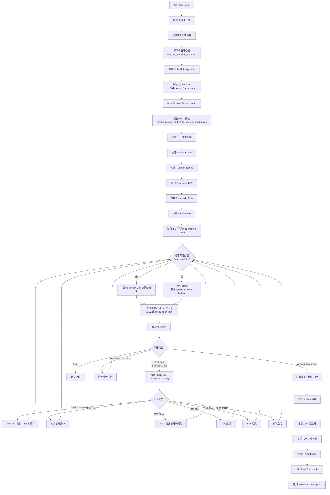
```mermaid
flowchart TD
    T0["run_turn() 入口"] --> T1["阶段 0: 准备工作"]
    
    T1 --> T1A["检查输入是否为空"]
    T1A --> T1B["预采样压缩检查<br/>run_pre_sampling_compact"]
    T1B --> T1C["加载 Skills 和 Plugin 注入"]
    T1C --> T1D["解析 @mentions<br/>（Skills, Apps, Connectors）"]
    T1D --> T1E["运行 Session Startup Hooks"]
    T1E --> T1F["检查 MCP 依赖<br/>maybe_prompt_and_install_mcp_dependencies"]
    
    T1F --> T2["阶段 1: 上下文组装"]
    T2 --> T2A["构建 Skill Injections"]
    T2A --> T2B["构建 Plugin Injections"]
    T2B --> T2C["构建 Connector 指令"]
    T2C --> T2D["构建 Personality 指令"]
    T2D --> T2E["组装 TurnContext"]
    
    T2E --> T3["阶段 2: 采样循环 (Sampling Loop)"]
    T3 --> T3A{"是否有待处理<br/>Function Calls?"}
    
    T3A -->|是| T3B["发送 Function Call 结果到模型"]
    T3A -->|否| T3C["构建 Prompt<br/>包括 system + user + history"]
    
    T3B --> T3D["发送请求到 Model Client<br/>（SSE 或 WebSocket 流式）"]
    T3C --> T3D
    
    T3D --> T3E["解析流式响应"]
    T3E --> T3F{"响应类型?"}
    
    T3F -->|"Tool Call<br/>(Function Call)"| T3G["路由到对应 Tool<br/>ToolRouter::route()"]
    T3F -->|"Assistant Message"| T3H["记录回复并结束 Turn"]
    T3F -->|"Error"| T3I["错误处理"]
    T3F -->|"Compaction Required"| T3J["执行对话压缩"]
    
    T3G --> T3K{"Tool 类型?"}
    T3K -->|"Shell Command"| T3L["Guardian 评估 → Exec 执行"]
    T3K -->|"File Ops"| T3M["文件读写操作"]
    T3K -->|"MCP Tool"| T3N["MCP 连接管理器调用"]
    T3K -->|"Plan Tool"| T3O["Plan 更新"]
    T3K -->|"Skill Tool"| T3P["Skill 切换"]
    T3K -->|"Apply Patch"| T3Q["补丁应用"]
    
    T3L --> T3A
    T3M --> T3A
    T3N --> T3A
    T3O --> T3A
    T3P --> T3A
    T3Q --> T3A
    T3J --> T3A
    
    T3H --> T4["阶段 3: Turn 结束"]
    T4 --> T4A["记录 Turn 元数据"]
    T4A --> T4B["发送 Turn 完成事件"]
    T4B --> T4C["更新 Thread 名称"]
    T4C --> T4D["运行 Post-Turn Hooks"]
    T4D --> DONE["返回 Assistant Message ID"]
```

### 7.4 Handlers — 事件分发器

`handlers.rs` 是 Session Event Loop 的事件处理分支：

```rust
// codex-rs/core/src/session/handlers.rs

// 中断当前任务
pub async fn interrupt(sess: &Arc<Session>) { ... }

// 清理后台终端进程
pub async fn clean_background_terminals(sess: &Arc<Session>) { ... }

// 用户输入或 Turn 启动（最重要的 handler）
pub async fn user_input_or_turn(sess: &Arc<Session>, sub_id: String, op: Op) {
    // 解析 Op → 提取 items, updates
    // 更新 SessionConfiguration
    // 调用 run_turn()
}

// 动态工具响应处理
pub async fn dynamic_tool_response(sess: &Arc<Session>, sub_id: String, response: DynamicToolResponse) { ... }
```

### 7.5 ModelClient — 与 LLM 通信的核心

`client.rs` 实现了与模型提供商通信的全部逻辑：

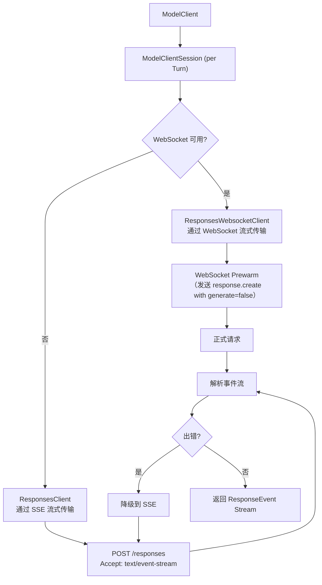
```mermaid
flowchart TD
    MC["ModelClient"] --> S["ModelClientSession (per Turn)"]
    S --> WST{"WebSocket 可用?"}
    
    WST -->|是| WS["ResponsesWebsocketClient<br/>通过 WebSocket 流式传输"]
    WST -->|否| SSE["ResponsesClient<br/>通过 SSE 流式传输"]
    
    WS --> PREWARM["WebSocket Prewarm<br/>（发送 response.create with generate=false）"]
    PREWARM --> WS_REQ["正式请求"]
    
    SSE --> SSE_REQ["POST /responses<br/>Accept: text/event-stream"]
    
    WS_REQ --> PARSE["解析事件流"]
    SSE_REQ --> PARSE
    
    PARSE --> RETRY{"出错?"}
    RETRY -->|是| FALLBACK["降级到 SSE"]
    RETRY -->|否| RETURN["返回 ResponseEvent Stream"]
    FALLBACK --> SSE_REQ
```

关键代码路径：

```rust
// codex-rs/core/src/client.rs
impl ModelClient {
    /// 为每个 Turn 创建一个 ModelClientSession
    pub async fn new_session(&self, ...) -> ModelClientSession { ... }
}

impl ModelClientSession {
    /// 流式发送请求
    pub async fn stream_response(
        &mut self,
        prompt: Prompt,
        turn_state: &mut TurnState,
    ) -> Result<impl Stream<Item = ResponseEvent>> { ... }
    
    /// WebSocket Prewarm（v2 优化）
    pub async fn prewarm_websocket(&mut self, ...) -> Result<()> { ... }
}
```

---

## 8. App-Server 架构

App-Server 是连接 TUI/Exec 客户端与 Core 引擎的中间层服务，通过 JSON-RPC 协议通信。

### 8.1 App-Server 启动流程

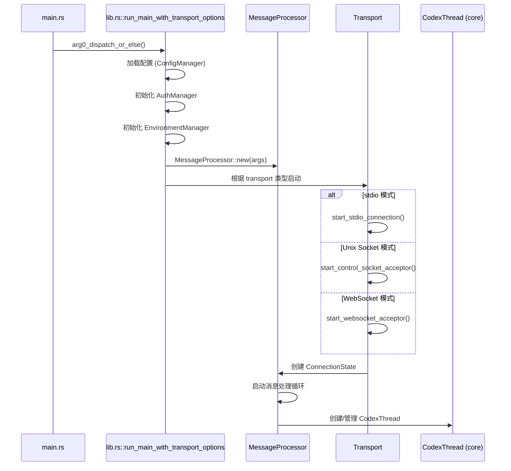
```mermaid
sequenceDiagram
    participant Main as main.rs
    participant Lib as lib.rs::run_main_with_transport_options
    participant MP as MessageProcessor
    participant T as Transport
    participant Core as CodexThread (core)

    Main->>Lib: arg0_dispatch_or_else()
    Lib->>Lib: 加载配置 (ConfigManager)
    Lib->>Lib: 初始化 AuthManager
    Lib->>Lib: 初始化 EnvironmentManager
    Lib->>MP: MessageProcessor::new(args)
    
    Lib->>T: 根据 transport 类型启动
    alt stdio 模式
        T->>T: start_stdio_connection()
    else Unix Socket 模式
        T->>T: start_control_socket_acceptor()
    else WebSocket 模式
        T->>T: start_websocket_acceptor()
    end
    
    T->>MP: 创建 ConnectionState
    MP->>MP: 启动消息处理循环
    MP->>Core: 创建/管理 CodexThread
```

### 8.2 JSON-RPC 协议

App-Server 使用 JSON-RPC 2.0 风格协议，通过宏系统自动生成 TypeScript 和 JSON Schema。

**Client → Server 请求** (`ClientRequest`)：

```rust
// 通过 client_request_definitions! 宏定义
// codex-rs/app-server-protocol/src/protocol/common.rs

client_request_definitions! {
    ThreadStart => "thread/start" {
        params: v2::ThreadStartParams,
        response: v2::ThreadStartResponse,
    },
    ThreadRead => "thread/read" {
        params: v2::ThreadReadParams,
        response: v2::ThreadReadResponse,
    },
    ThreadResume => "thread/resume" {
        params: v2::ThreadResumeParams,
        response: v2::ThreadResumeResponse,
    },
    TurnStart => "turn/start" {
        params: v2::TurnStartParams,
        response: v2::TurnStartResponse,
    },
    TurnSteer => "turn/steer" {
        params: v2::TurnSteerParams,
        response: v2::TurnSteerResponse,
    },
    TurnInterrupt => "turn/interrupt" {
        params: v2::TurnInterruptParams,
        response: v2::TurnInterruptResponse,
    },
    // ... 更多方法
}
```

**Server → Client 通知** (`ServerNotification`)：

```rust
// 通过 server_notification_definitions! 宏定义
server_notification_definitions! {
    TurnStartedNotification(TurnStartedNotification),
    ThreadStatusChangedNotification(ThreadStatusChangedNotification),
    ExecOutputDeltaEventNotification(ExecOutputDeltaEventNotification),
    // ... 更多通知
}
```

**Server → Client 请求** (`ServerRequest`)：

```rust
server_request_definitions! {
    CommandExecutionRequestApproval,
    FileChangeRequestApproval,
    McpServerElicitationRequest,
    PermissionsRequestApproval,
    DynamicToolCall,
    // ... 更多请求
}
```

### 8.3 MessageProcessor — 消息处理核心

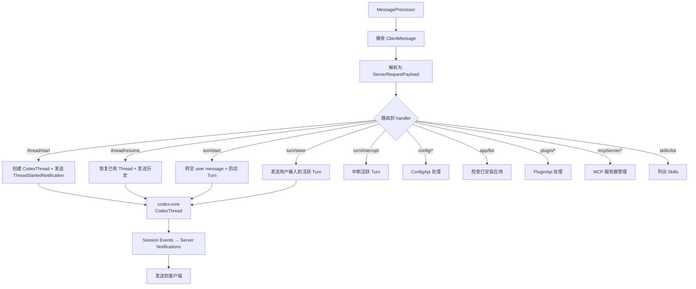
```mermaid
flowchart TD
    MP["MessageProcessor"] --> RECV["接收 ClientMessage"]
    RECV --> PARSE["解析为 ServerRequestPayload"]
    PARSE --> ROUTE{"路由到 handler"}
    
    ROUTE -->|"thread/start"| TH_START["创建 CodexThread + 发送 ThreadStartedNotification"]
    ROUTE -->|"thread/resume"| TH_RESUME["恢复已有 Thread + 发送历史"]
    ROUTE -->|"turn/start"| TURN_START["转交 user message + 启动 Turn"]
    ROUTE -->|"turn/steer"| TURN_STEER["发送用户输入到活跃 Turn"]
    ROUTE -->|"turn/interrupt"| TURN_INT["中断活跃 Turn"]
    ROUTE -->|"config/*"| CONFIG["ConfigApi 处理"]
    ROUTE -->|"app/list"| APP_LIST["检查已安装应用"]
    ROUTE -->|"plugin/*"| PLUGIN["PluginApi 处理"]
    ROUTE -->|"mcpServer/*"| MCP["MCP 服务器管理"]
    ROUTE -->|"skills/list"| SKILLS["列出 Skills"]
    
    TH_START --> CORE["codex-core<br/>CodexThread"]
    TH_RESUME --> CORE
    TURN_START --> CORE
    TURN_STEER --> CORE
    
    CORE --> EVENTS["Session Events → Server Notifications"]
    EVENTS --> SEND["发送到客户端"]
```

### 8.4 ThreadState — 线程状态管理

```rust
// codex-rs/app-server/src/thread_state.rs

pub(crate) struct ThreadState {
    pub(crate) pending_interrupts: PendingInterruptQueue,     // 待处理中断队列
    pub(crate) pending_rollbacks: Option<ConnectionRequestId>, // 待处理回滚
    pub(crate) turn_summary: TurnSummary,                     // 当前 Turn 摘要
    pub(crate) cancel_tx: Option<oneshot::Sender<()>>,        // 取消通道
    pub(crate) experimental_raw_events: bool,                 // 是否发送原始事件
    pub(crate) listener_generation: u64,                      // 监听器代数
    current_turn_history: ThreadHistoryBuilder,               // 当前 Turn 历史构建
    listener_thread: Option<Weak<CodexThread>>,              // 监听线程引用
}
```

---

## 9. TUI 终端界面架构

TUI 基于 `ratatui` 库实现，提供终端内的交互式界面。

### 9.1 TUI 主体架构

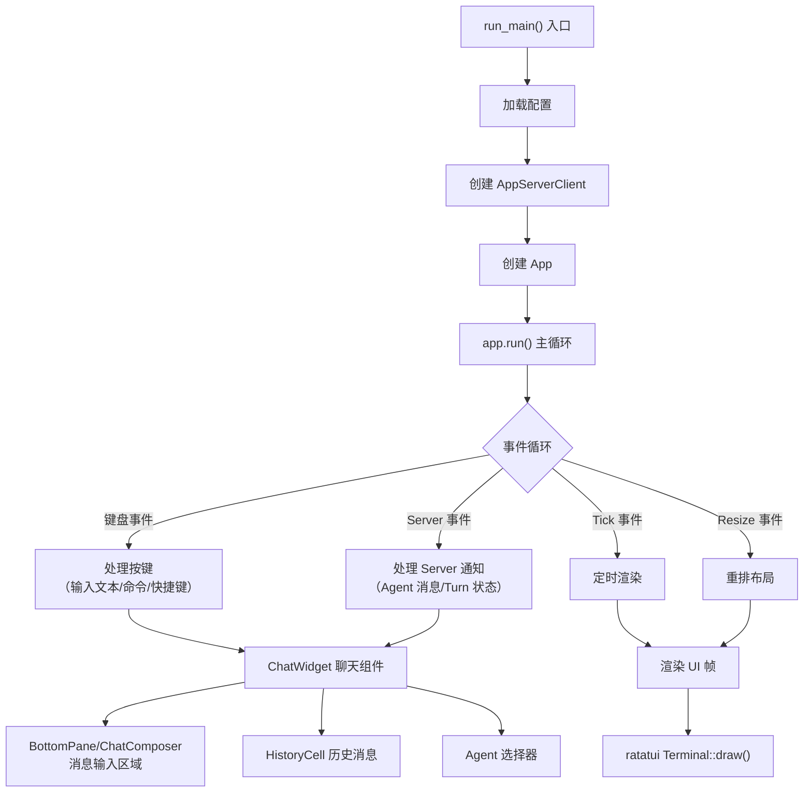
```mermaid
flowchart TD
    MAIN["run_main() 入口"] --> CONFIG["加载配置"]
    CONFIG --> CLIENT["创建 AppServerClient"]
    CLIENT --> APP["创建 App"]
    APP --> RUN["app.run() 主循环"]
    
    RUN --> EVENT_LOOP{"事件循环"}
    EVENT_LOOP -->|"键盘事件"| KEY["处理按键<br/>（输入文本/命令/快捷键）"]
    EVENT_LOOP -->|"Server 事件"| SRV["处理 Server 通知<br/>（Agent 消息/Turn 状态）"]
    EVENT_LOOP -->|"Tick 事件"| TICK["定时渲染"]
    EVENT_LOOP -->|"Resize 事件"| RESIZE["重排布局"]
    
    KEY --> CHAT["ChatWidget 聊天组件"]
    SRV --> CHAT
    TICK --> RENDER["渲染 UI 帧"]
    RESIZE --> RENDER
    
    CHAT --> COMPOSER["BottomPane/ChatComposer<br/>消息输入区域"]
    CHAT --> HISTORY["HistoryCell 历史消息"]
    CHAT --> AGENT["Agent 选择器"]
    
    RENDER --> DRAW["ratatui Terminal::draw()"]
```

### 9.2 App 结构

```rust
// codex-rs/tui/src/app.rs

pub struct App {
    // 应用状态
    pub mode: AppMode,                       // 当前模式
    pub chat: ChatWidget,                    // 聊天组件
    pub bottom_pane: BottomPane,             // 底部输入面板
    pub history: HistoryCell,                // 历史消息
    pub model_catalog: ModelCatalog,         // 模型目录
    pub resume_picker: Option<ResumePicker>, // 会话恢复选择器
    pub file_search: FileSearchManager,      // 文件搜索
    pub notifications: NotificationManager,  // 通知
    // ...
}
```

### 9.3 App-Server Session — TUI 与 Server 交互

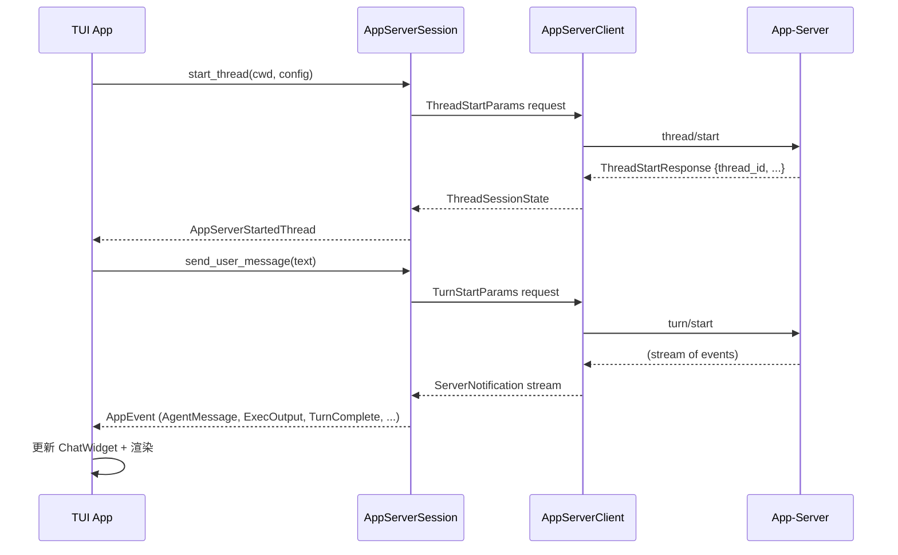
```mermaid
sequenceDiagram
    participant TUI as TUI App
    participant ASS as AppServerSession
    participant ASC as AppServerClient
    participant AS as App-Server

    TUI->>ASS: start_thread(cwd, config)
    ASS->>ASC: ThreadStartParams request
    ASC->>AS: thread/start
    AS-->>ASC: ThreadStartResponse {thread_id, ...}
    ASC-->>ASS: ThreadSessionState
    ASS-->>TUI: AppServerStartedThread

    TUI->>ASS: send_user_message(text)
    ASS->>ASC: TurnStartParams request
    ASC->>AS: turn/start
    AS-->>ASC: (stream of events)
    ASC-->>ASS: ServerNotification stream
    ASS-->>TUI: AppEvent (AgentMessage, ExecOutput, TurnComplete, ...)
    TUI->>TUI: 更新 ChatWidget + 渲染
```

---

## 10. 工具系统 (Tools)

### 10.1 工具架构概览

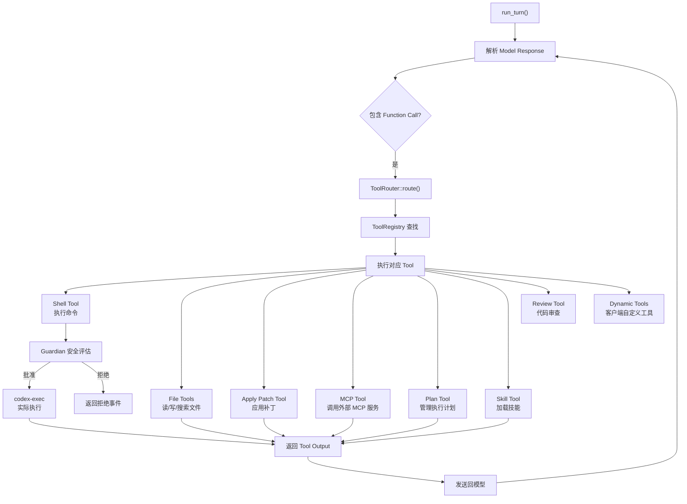
```mermaid
flowchart TD
    TURN["run_turn()"] --> PARSE["解析 Model Response"]
    PARSE --> FC{"包含 Function Call?"}
    FC -->|是| ROUTER["ToolRouter::route()"]
    
    ROUTER --> REG["ToolRegistry 查找"]
    REG --> EXECUTE["执行对应 Tool"]
    
    EXECUTE --> SHELL["Shell Tool<br/>执行命令"]
    EXECUTE --> FILE_OPS["File Tools<br/>读/写/搜索文件"]
    EXECUTE --> PATCH["Apply Patch Tool<br/>应用补丁"]
    EXECUTE --> MCP_TOOL["MCP Tool<br/>调用外部 MCP 服务"]
    EXECUTE --> PLAN["Plan Tool<br/>管理执行计划"]
    EXECUTE --> SKILL_TOOL["Skill Tool<br/>加载技能"]
    EXECUTE --> REVIEW["Review Tool<br/>代码审查"]
    EXECUTE --> DYNAMIC["Dynamic Tools<br/>客户端自定义工具"]
    
    SHELL --> GUARDIAN["Guardian 安全评估"]
    GUARDIAN -->|"批准"| EXEC["codex-exec<br/>实际执行"]
    GUARDIAN -->|"拒绝"| DENIED["返回拒绝事件"]
    
    EXEC --> OUTPUT["返回 Tool Output"]
    FILE_OPS --> OUTPUT
    PATCH --> OUTPUT
    MCP_TOOL --> OUTPUT
    PLAN --> OUTPUT
    SKILL_TOOL --> OUTPUT
    
    OUTPUT --> SEND_TO_MODEL["发送回模型"]
    SEND_TO_MODEL --> PARSE
```

### 10.2 Shell 命令执行路径

Shell 命令是最常用的工具，执行路径如下：

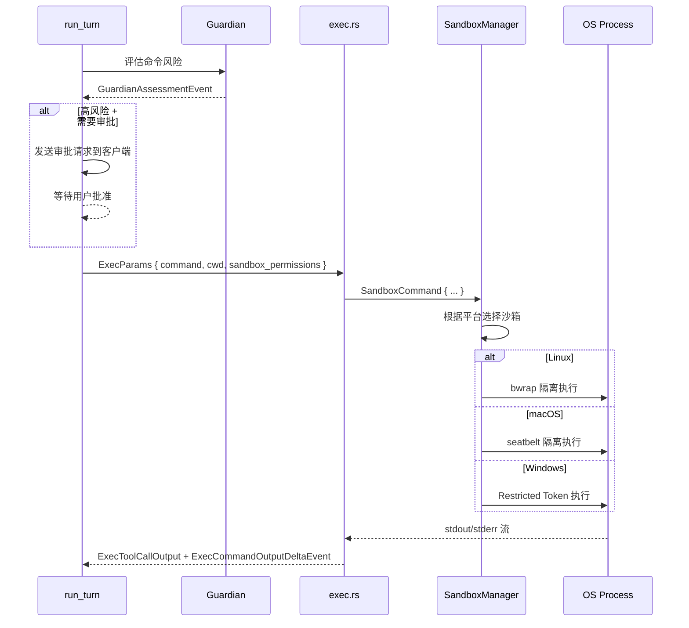
```mermaid
sequenceDiagram
    participant Turn as run_turn
    participant Guardian as Guardian
    participant Exec as exec.rs
    participant Sandbox as SandboxManager
    participant Process as OS Process

    Turn->>Guardian: 评估命令风险
    Guardian-->>Turn: GuardianAssessmentEvent
    
    alt 高风险 + 需要审批
        Turn->>Turn: 发送审批请求到客户端
        Turn-->>Turn: 等待用户批准
    end
    
    Turn->>Exec: ExecParams { command, cwd, sandbox_permissions }
    Exec->>Sandbox: SandboxCommand { ... }
    Sandbox->>Sandbox: 根据平台选择沙箱
    alt Linux
        Sandbox->>Process: bwrap 隔离执行
    else macOS
        Sandbox->>Process: seatbelt 隔离执行
    else Windows
        Sandbox->>Process: Restricted Token 执行
    end
    
    Process-->>Exec: stdout/stderr 流
    Exec-->>Turn: ExecToolCallOutput + ExecCommandOutputDeltaEvent
```

### 10.3 工具注册系统

工具通过 `ToolRegistry` 管理：

```rust
// 工具注册流程
// 1. 基础工具在 Session 初始化时注册
// 2. MCP 工具在 MCP 连接建立后动态注册
// 3. Plugin 工具通过 Plugin 系统扩展
// 4. Dynamic Tools 由客户端自定义

pub struct ToolRouter {
    registry: ToolRegistry,
    // 工具路由参数
}

impl ToolRouter {
    pub async fn route(&self, call: FunctionCall) -> Result<ToolOutput> {
        let tool = self.registry.get(&call.name)?;
        tool.execute(call.arguments).await
    }
}
```

---

## 11. MCP 集成架构

Model Context Protocol (MCP) 允许 Codex 连接外部工具服务器。

### 11.1 MCP 架构

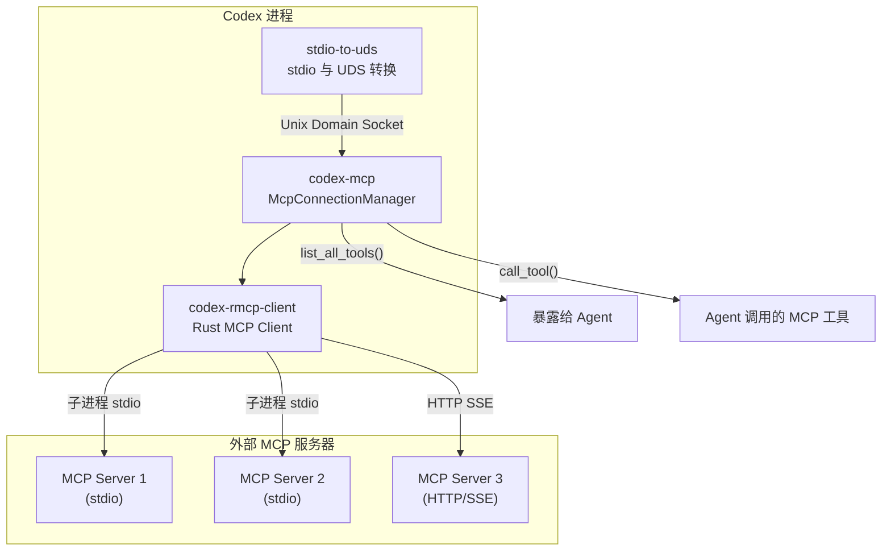
```mermaid
flowchart TD
    subgraph CODEX["Codex 进程"]
        CM["codex-mcp<br/>McpConnectionManager"]
        RMC["codex-rmcp-client<br/>Rust MCP Client"]
        STDIO["stdio-to-uds<br/>stdio 与 UDS 转换"]
    end
    
    subgraph EXTERNAL["外部 MCP 服务器"]
        MCP1["MCP Server 1<br/>(stdio)"]
        MCP2["MCP Server 2<br/>(stdio)"]
        MCP3["MCP Server 3<br/>(HTTP/SSE)"]
    end
    
    CM --> RMC
    RMC -->|"子进程 stdio"| MCP1
    RMC -->|"子进程 stdio"| MCP2
    RMC -->|"HTTP SSE"| MCP3
    STDIO -->|"Unix Domain Socket"| CM
    
    CM -->|"list_all_tools()"| TOOLS["暴露给 Agent"]
    CM -->|"call_tool()"| CALL["Agent 调用的 MCP 工具"]
```

### 11.2 MCP 配置

MCP 服务器在 `config.toml` 中配置：

```toml
[mcp_servers.my_server]
command = "npx"
args = ["-y", "@modelcontextprotocol/server-github"]
env = { GITHUB_TOKEN = "..." }
```

### 11.3 Codex 作为 MCP Server

Codex 自身也可以作为 MCP 服务器运行：

```bash
codex mcp-server   # 以 MCP 服务器模式启动（stdio 传输）
```

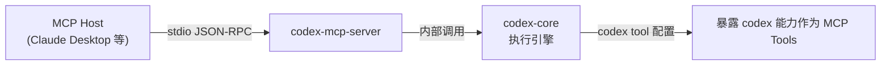
```mermaid
flowchart LR
    HOST["MCP Host<br/>(Claude Desktop 等)"] -->|"stdio JSON-RPC"| CS["codex-mcp-server"]
    CS -->|"内部调用"| CORE["codex-core<br/>执行引擎"]
    CORE -->|"codex tool 配置"| TOOLS["暴露 codex 能力作为 MCP Tools"]
```

---

## 12. Sandbox 沙箱系统

沙箱系统确保 AI 生成的命令在受限环境中执行。

### 12.1 三平台沙箱对比

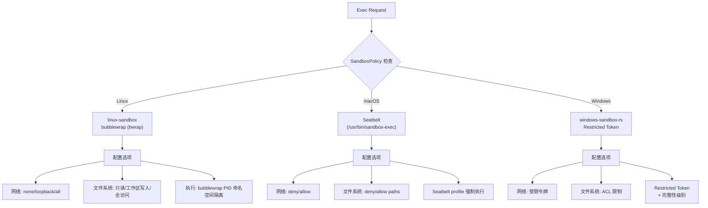
```mermaid
flowchart TD
    REQUEST["Exec Request"] --> POLICY{"SandboxPolicy 检查"}
    
    POLICY -->|"Linux"| LINUX["linux-sandbox<br/>bubblewrap (bwrap)"]
    POLICY -->|"macOS"| MACOS["Seatbelt<br/>(/usr/bin/sandbox-exec)"]
    POLICY -->|"Windows"| WIN["windows-sandbox-rs<br/>Restricted Token"]
    
    LINUX --> LCONF["配置选项"]
    LCONF --> LNET["网络: none/loopback/all"]
    LCONF --> LFS["文件系统: 只读/工作区写入/全访问"]
    LCONF --> LEXEC["执行: bubblewrap PID 命名空间隔离"]
    
    MACOS --> MCONF["配置选项"]
    MCONF --> MNET["网络: deny/allow"]
    MCONF --> MFS["文件系统: deny/allow paths"]
    MCONF --> MLEXEC["Seatbelt profile 强制执行"]
    
    WIN --> WCONF["配置选项"]
    WCONF --> WNET["网络: 受限令牌"]
    WCONF --> WFS["文件系统: ACL 限制"]
    WCONF --> WEXEC["Restricted Token<br/>+ 完整性级别"]
```

### 12.2 SandboxPolicy 结构

```rust
// 权限配置文件定义了沙箱策略
pub struct PermissionProfile {
    pub enforcement: SandboxEnforcement,        // 强制模式
    pub file_system: FileSystemPermissions,     // 文件系统权限
    pub network: NetworkPermissions,            // 网络权限
}

pub struct SandboxPolicy {
    pub file_system: Vec<SandboxEntry>,         // 文件系统沙箱条目
    pub network: NetworkAccess,                 // 网络访问控制
    pub allow_unsafe_package_management: bool,  // 是否允许包管理器
}
```

### 12.3 执行隔离流程

```rust
// codex-rs/core/src/exec.rs

pub async fn exec_command_with_sandbox(params: ExecParams) -> Result<ExecOutput> {
    // 1. 构建 SandboxCommand
    let sandbox_cmd = SandboxCommand::new(params.command)
        .with_filesystem_policy(params.sandbox_permissions.filesystem())
        .with_network_policy(params.sandbox_permissions.network());
    
    // 2. 通过 SandboxManager 执行
    let mut child = SandboxManager::spawn(sandbox_cmd).await?;
    
    // 3. 捕获输出流
    let (stdout, stderr) = tokio::join!(
        read_capped(child.stdout.take().unwrap()),
        read_capped(child.stderr.take().unwrap()),
    );
    
    // 4. 等待进程退出（带超时）
    let exit_status = tokio::time::timeout(
        Duration::from_millis(params.timeout_ms),
        child.wait(),
    ).await?;
    
    Ok(ExecOutput { stdout, stderr, exit_status })
}
```

---

## 13. Plugin 与 Skills 系统

### 13.1 Plugin 系统

Plugin 是 Codex 的扩展机制，可提供：
- **App Connectors**：连接第三方应用
- **MCP Servers**：作为 Codex 内的 MCP 服务器
- **Skills**：专业领域指令集合

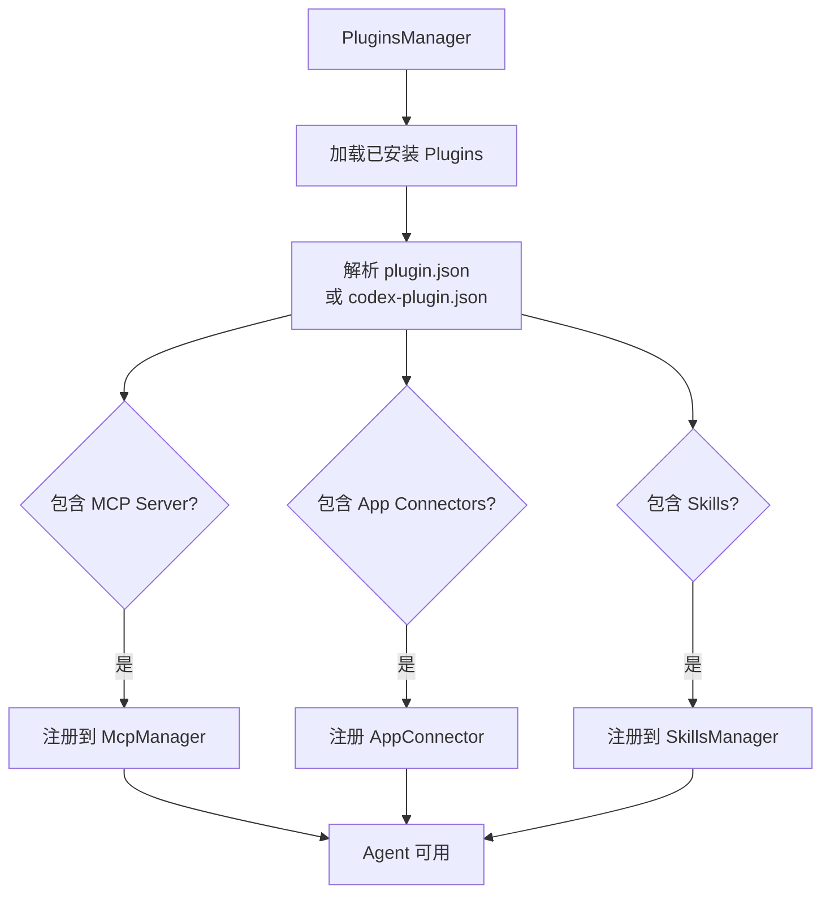
```mermaid
flowchart TD
    PM["PluginsManager"] --> LOAD["加载已安装 Plugins"]
    LOAD --> PARSE["解析 plugin.json<br/>或 codex-plugin.json"]
    
    PARSE --> MCP{"包含 MCP Server?"}
    PARSE --> CONN{"包含 App Connectors?"}
    PARSE --> SKILL{"包含 Skills?"}
    
    MCP -->|是| REG_MCP["注册到 McpManager"]
    CONN -->|是| REG_CONN["注册 AppConnector"]
    SKILL -->|是| REG_SKILL["注册到 SkillsManager"]
    
    REG_MCP --> USABLE["Agent 可用"]
    REG_CONN --> USABLE
    REG_SKILL --> USABLE
```

### 13.2 Plugin 结构

```
my-plugin/
├── .codex-plugin/
│   └── plugin.json           # 插件元数据
├── skills/                   # 可选 Skills
│   └── my-skill/
│       ├── SKILL.md          # Skill 定义
│       └── ...
├── mcp-server/               # 可选 MCP Server
│   └── ...
└── connectors/               # 可选 App Connectors
    └── ...
```

`plugin.json` 示例：

```json
{
  "name": "my-plugin",
  "display_name": "My Plugin",
  "description": "A sample plugin",
  "version": "1.0.0",
  "capabilities": {
    "skills": ["my-skill"],
    "mcp_servers": [],
    "app_connectors": ["github"]
  }
}
```

### 13.3 Skills 系统

Skills 是 Agent 可动态加载的专业指令：

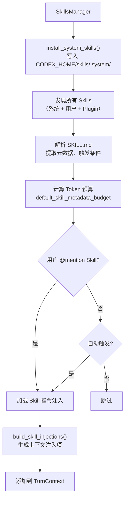
```mermaid
flowchart TD
    SM["SkillsManager"] --> INSTALL["install_system_skills()<br/>写入 CODEX_HOME/skills/.system/"]
    INSTALL --> DISCOVER["发现所有 Skills<br/>（系统 + 用户 + Plugin）"]
    
    DISCOVER --> PARSE["解析 SKILL.md<br/>提取元数据、触发条件"]
    PARSE --> BUDGET["计算 Token 预算<br/>default_skill_metadata_budget"]
    
    BUDGET --> MENTION{"用户 @mention Skill?"}
    MENTION -->|是| LOAD["加载 Skill 指令注入"]
    MENTION -->|否| AUTO{"自动触发?"}
    
    AUTO -->|是| LOAD
    AUTO -->|否| SKIP["跳过"]
    
    LOAD --> INJECT["build_skill_injections()<br/>生成上下文注入项"]
    INJECT --> CTX["添加到 TurnContext"]
```

**SKILL.md 结构**：

```markdown
---
name: my-skill
description: Does something useful
triggers:
  - keyword: "deploy"
---

# My Skill

When the user asks about deployment...
```

### 13.4 Skill 注入流程

```rust
// codex-rs/core/src/session/turn.rs (turn 执行中)

// 1. 收集显式提及的 Skills
let mentioned_skills = collect_explicit_skill_mentions(
    &input, &skills, &disabled_paths, &connector_slug_counts,
);

// 2. 构建 Skill 注入
let SkillInjections { items, warnings } = build_skill_injections(
    &mentioned_skills,
    skills_outcome,
    Some(&session_telemetry),
    &analytics_client,
    tracking,
).await;

// 3. 将 Skill 指令注入到模型上下文
let skill_items: Vec<ResponseItem> = skill_injections
    .iter()
    .map(|skill| ContextualUserFragment::into(
        crate::context::SkillInstructions::from(skill)
    ))
    .collect();
```

---

## 14. 模型提供商系统

### 14.1 提供商架构

```mermaid
flowchart TD
    MC["ModelClient<br/>(codex-core/client.rs)"] --> API["codex-api<br/>OpenAI API 封装"]
    API --> MP["codex-model-provider<br/>提供商适配"]
    
    MP --> AUTH["认证系统"]
    AUTH --> APIKEY["API Key"]
    AUTH --> CHATGPT["ChatGPT OAuth"]
    AUTH --> AGENTID["Agent Identity"]
    
    MP --> TRANSPORT["codex-client<br/>HTTP 传输层"]
    TRANSPORT --> REQWEST["reqwest HTTP Client"]
    TRANSPORT --> CUSTOM_CA["自定义 CA 证书"]
    TRANSPORT --> RETRY["重试与退避"]
    
    API --> SSE["SSE 流式传输"]
    API --> WS["WebSocket 流式传输<br/>（v2 新特性）"]
    
    SSE --> PROVIDER["目标 LLM 服务"]
    WS --> PROVIDER
```

### 14.2 支持的提供商

| 提供商 | Crate | 说明 |
|--------|-------|------|
| OpenAI / 自定义 | `codex-model-provider` | 通过 Bearer Token 认证，可配置 base_url |
| Ollama | `codex-ollama` | 本地模型运行 |
| LM Studio | `codex-lmstudio` | 本地模型运行 |
| Amazon Bedrock | `model-provider/amazon_bedrock` | AWS Bedrock 集成 |

### 14.3 ModelClient 内部客户端创建

```rust
// codex-rs/core/src/client.rs

impl ModelClient {
    pub async fn new(config: ModelClientConfig) -> Result<Self> {
        // 1. 构建认证提供者
        let auth_provider = build_auth_provider(&config.auth).await?;
        
        // 2. 构建 HTTP 传输层
        let transport = ReqwestTransport::new(client)
            .with_custom_ca(config.custom_ca)
            .with_retry(config.retry_config);
        
        // 3. 创建 API 客户端
        let api_provider = match config.protocol {
            ProtocolVersion::V1 => ApiProvider::Responses(ResponsesClient::new(...)),
            ProtocolVersion::V2 => ApiProvider::ResponsesWebsocket(WebsocketClient::new(...)),
        };
        
        Ok(Self { auth_provider, transport, api_provider })
    }
}
```

---

## 15. 数据流转全景图

### 15.1 一次完整交互的端到端流程

```mermaid
sequenceDiagram
    actor User
    participant TUI as TUI App
    participant ASC as AppServerClient
    participant AS as App-Server
    participant Core as codex-core
    participant MC as ModelClient
    participant LLM as LLM 服务
    participant Sandbox as 沙箱

    User->>TUI: 输入 "帮我创建一个 Python HTTP 服务器"
    TUI->>ASC: turn/start { items: [user_message] }
    ASC->>AS: JSON-RPC request
    AS->>Core: CodexThread::submit(Op::UserTurn)
    
    Core->>Core: Session Event Loop 收到 Op
    Core->>Core: handlers::user_input_or_turn()
    
    Note over Core: Turn 准备阶段
    Core->>Core: 加载 Skills/Plugins
    Core->>Core: 解析 @mentions
    Core->>Core: 运行 Session Hooks
    
    Note over Core: 上下文组装
    Core->>Core: 构建 Skill/Plugin 注入
    Core->>Core: 组装 Full Prompt
    
    Note over Core: 采样循环开始
    Core->>MC: stream_response(prompt)
    MC->>LLM: POST /responses (SSE/WS)
    LLM-->>MC: event: response.created
    LLM-->>MC: event: response.output_text.delta "我来帮你创建..."
    LLM-->>MC: event: response.function_call_arguments.done { name: "shell", args: "..."}
    
    MC-->>Core: ResponseEvent::FunctionCall
    Core->>Core: ToolRouter::route() → Shell Tool
    Core->>Core: Guardian 评估命令
    Core->>Sandbox: 执行命令（沙箱隔离）
    Sandbox-->>Core: stdout: "Server running on port 8000"
    Core->>Core: 将结果发回模型
    
    Core->>MC: 继续采样（带 tool output）
    MC->>LLM: POST /responses (含 tool call output)
    LLM-->>MC: event: response.output_text.done "已创建服务器！"
    LLM-->>MC: event: response.completed
    
    MC-->>Core: ResponseEvent::Completed
    Core->>Core: 记录 Turn 完成
    Core->>Core: 运行 Post-Turn Hooks
    
    Core-->>AS: Event Stream
    AS-->>ASC: ServerNotification (AgentMessage, TurnCompleted, ...)
    ASC-->>TUI: AppEvent
    TUI->>TUI: 渲染 Agent 消息 + Token 用量
    TUI-->>User: 显示 "已创建服务器！"
```

### 15.2 事件流架构

```mermaid
flowchart LR
    subgraph CORE["codex-core 内部"]
        SE["Session Event Loop"] -->|"Event"| TX["tx_event channel"]
        TX -->|"Event"| HANDLERS["handlers dispatch"]
        HANDLERS -->|"副作用"| TURN["turn::run_turn"]
        TURN -->|"AgentMessage<br/>ToolCall<br/>Error"| EVENT_BUS["Event Bus"]
    end
    
    EVENT_BUS -->|"转换为"| SN["ServerNotification"]
    SN -->|"JSON-RPC"| CLIENT["客户端 (TUI/Exec)"]
    CLIENT -->|"UI Event"| RENDER["渲染界面"]
    
    CLIENT -->|"turn/steer<br/>审批响应"| SR["ServerRequest"]
    SR -->|"JSON-RPC"| AS["App-Server"]
    AS -->|"反馈到"| SE
```

---

## 16. 构建系统

项目使用 **Bazel** 作为主构建系统，同时也支持 Cargo 构建。

### 16.1 构建工具

| 工具 | 用途 | 配置文件 |
|------|------|---------|
| Bazel | 主构建系统 | `BUILD.bazel`, `MODULE.bazel`, `.bazelrc` |
| Cargo | Rust 开发构建 | `Cargo.toml`, `Cargo.lock` |
| Just | 任务运行器 | `justfile` |
| pnpm | Node.js 包管理 | `package.json`, `pnpm-workspace.yaml` |

### 16.2 Justfile 主要任务

```makefile
# 代码格式化
just fmt                    # 运行 rustfmt
just fix                    # 运行 clippy fix

# 构建
just build                  # 构建所有目标
just release-build          # Release 构建

# 测试
just test                   # 运行所有测试
just test -p codex-tui      # 运行特定 crate 测试

# 代码生成
just write-config-schema    # 生成配置 JSON Schema
just write-app-server-schema  # 生成 App-Server Schema

# 依赖管理
just bazel-lock-update      # 更新 Bazel lock 文件
just bazel-lock-check       # 检查 Bazel lock 一致性
```

### 16.3 关键构建目标

```mermaid
flowchart TD
    ROOT["项目根"] --> BAZEL["Bazel 构建"]
    ROOT --> CARGO["Cargo 构建"]
    
    BAZEL --> BINARIES["二进制产出"]
    BINARIES --> BIN1["codex (多合一 CLI)"]
    BINARIES --> BIN2["codex-tui (TUI 独立)"]
    BINARIES --> BIN3["codex-app-server (服务)"]
    BINARIES --> BIN4["codex-exec-server (执行)"]
    
    CARGO --> CBIN1["cargo run -p codex"]
    CARGO --> CBIN2["cargo run -p codex-tui"]
    CARGO --> CTEST["cargo test -p codex-core"]
```

---

## 17. 配置文件系统

### 17.1 配置加载层级

Codex 配置使用分层加载机制，优先级从低到高：

```mermaid
flowchart TD
    L1["1. 内置默认值<br/>（硬编码在 Config::default()）"] --> L2
    L2["2. 全局配置<br/>（/etc/codex/config.toml 或托管配置）"] --> L3
    L3["3. 用户配置<br/>（~/.codex/config.toml）"] --> L4
    L4["4. 项目配置<br/>（.codex/config.toml）"] --> L5
    L5["5. 环境变量<br/>（CODEX_* 前缀）"] --> L6
    L6["6. CLI 参数<br/>（-c/--config 覆盖）"] --> FINAL["最终生效配置"]
```

### 17.2 主要配置项

```toml
# ~/.codex/config.toml

[model_provider]
id = "openai"                   # 或 "ollama", "lmstudio"
base_url = "https://api.openai.com/v1"  # 可改为内部 LLM 服务

[collaboration_mode.mode.default.settings]
model = "gpt-5.1"              # 默认模型
reasoning_effort = "medium"    # 推理努力程度

[sandbox]
mode = "workspace-write"       # 沙箱模式
network = "none"                # 网络访问

[approvals]
policy = "on-request"          # 审批策略

[mcp_servers]
# 外部 MCP 服务器配置

[plugins]
# 插件市场配置

[skills]
# Skills 配置
```

详见 `docs/config.md` 获取完整配置文档。

---

## 18. 附录：关键文件索引

以下列出了解本项目需要重点阅读的文件及其核心内容：

### 入口文件

| 文件 | 内容 |
|------|------|
| `codex-rs/Cargo.toml` | Workspace 定义，所有 crate 列表 |
| `codex/src/main.rs` | CLI 多合一入口，子命令路由 |
| `codex-rs/tui/src/main.rs` | TUI 独立入口 |
| `codex-rs/app-server/src/main.rs` | App-Server 独立入口 |

### 核心引擎文件

| 文件 | 大小 | 核心内容 |
|------|------|---------|
| `codex-rs/core/src/session/session.rs` | ~1000行 | Session 定义、初始化、配置管理 |
| `codex-rs/core/src/session/turn.rs` | ~2200行 | **Turn 执行核心**：采样循环、工具路由 |
| `codex-rs/core/src/session/handlers.rs` | ~1200行 | 事件处理器：interrupt, user_input_or_turn, undo, review |
| `codex-rs/core/src/client.rs` | ~2400行 | **ModelClient**：SSE/WebSocket 流式请求 |
| `codex-rs/core/src/codex_thread.rs` | ~460行 | 对外 API：CodexThread 抽象 |
| `codex-rs/core/src/exec.rs` | ~1000行 | 命令执行：沙箱化进程启动与输出捕获 |
| `codex-rs/core/src/guardian/mod.rs` | ~800行 | Guardian 安全检查系统 |

### App-Server 文件

| 文件 | 内容 |
|------|------|
| `codex-rs/app-server/src/lib.rs` | App-Server 启动与配置 |
| `codex-rs/app-server/src/message_processor.rs` | 消息处理核心：路由 ClientRequest + CodexMessageProcessor |
| `codex-rs/app-server/src/thread_state.rs` | Thread 运行时状态管理 |
| `codex-rs/app-server/src/transport/mod.rs` | 传输层：stdio/UnixSocket/WebSocket |

### 协议文件

| 文件 | 内容 |
|------|------|
| `codex-rs/app-server-protocol/src/protocol/common.rs` | JSON-RPC 宏系统（client_request_definitions! 等） |
| `codex-rs/app-server-protocol/src/protocol/v2.rs` | V2 API 所有类型定义 |
| `codex-rs/protocol/src/protocol.rs` | 内部协议：Op, Event, Submission, AgentStatus |

### TUI 文件

| 文件 | 内容 |
|------|------|
| `codex-rs/tui/src/app.rs` | TUI App 主结构 |
| `codex-rs/tui/src/chatwidget.rs` | 聊天界面组件 |
| `codex-rs/tui/src/app_server_session.rs` | TUI 与 App-Server 会话管理 |
| `codex-rs/tui/src/markdown_render.rs` | Markdown 渲染 |

### 文档文件

| 文件 | 内容 |
|------|------|
| `AGENTS.md` | Rust 开发规范（AGENTS.md） |
| `README.md` | 本仓库说明（企业部署修改） |
| `docs/config.md` | 完整配置文档 |
| `docs/skills.md` | Skills 系统文档 |
| `docs/sandbox.md` | 沙箱系统文档 |
| `docs/exec.md` | 命令执行文档 |
| `docs/authentication.md` | 认证文档 |
| `docs/agents_md.md` | AGENTS.md 规范说明 |

---

## 总结

Codex CLI 是一个复杂但设计精良的 AI 编程助手。理解它的关键在于把握以下核心流程：

1. **入口 → AppServerClient → App-Server → codex-core**
2. **codex-core 内：Session(.new) → Event Loop → handlers → turn::run_turn**
3. **run_turn 内：准备 → 上下文组装 → 采样循环（模型推理 ⇄ 工具调用）→ 结束**

整个系统围绕 **Session → Turn → Tool → Model** 这四个核心抽象构建，通过 **JSON-RPC** 协议解耦客户端与服务端，通过 **Plugin/Skills/MCP** 实现扩展性，通过 **Sandbox** 确保安全性。

建议按以下顺序阅读代码：
1. 先看 `protocol.rs` 理解 Op/Event 类型
2. 看 `session/session.rs` 理解 Session 结构
3. 看 `session/handlers.rs` 理解事件分发
4. 看 `session/turn.rs` 的 `run_turn()` 理解核心执行
5. 看 `client.rs` 理解模型通信
6. 最后看 `app-server/` 理解服务层封装
